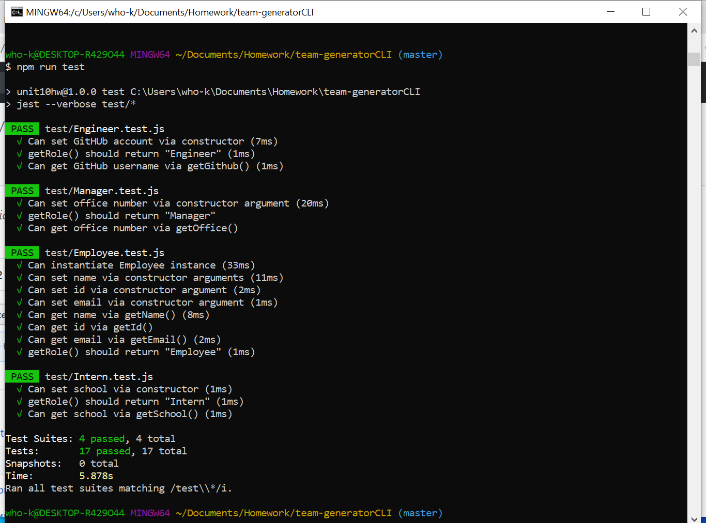
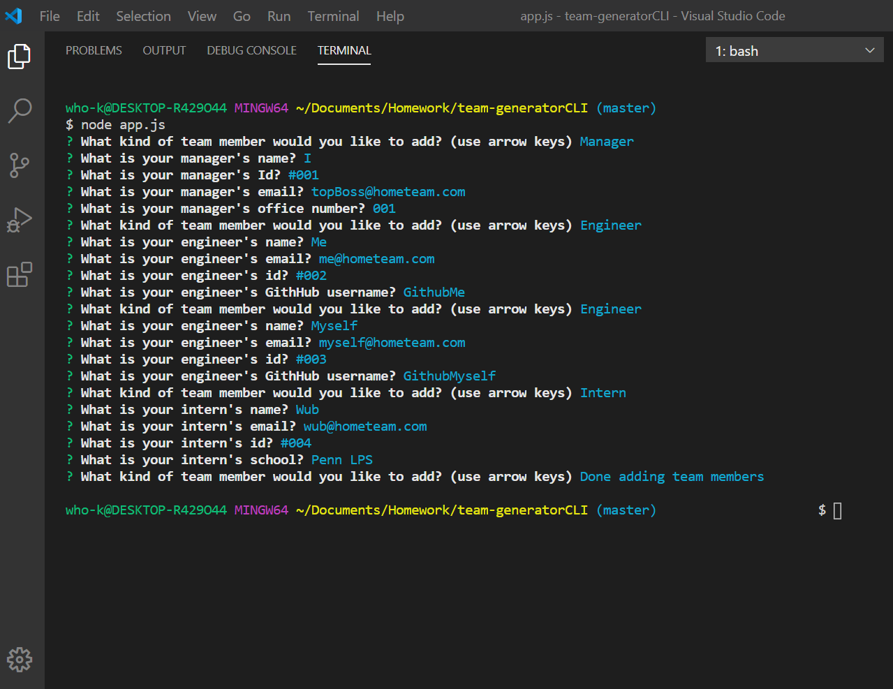
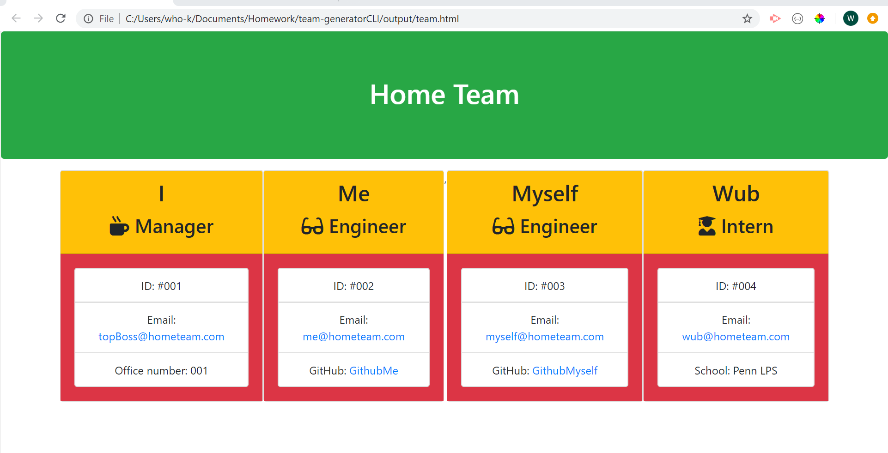

# team-generatorCLI

## Table of Contents
<!--ts-->
   * [Project Description](#project-description)
   * [Technologies Used](#technologies-used) 
   * [Dependencies](#dependencies)
   * [Tests](#tests)
   * [Using Repo](#using-repo)
   * [Contributing to the repo](#contributing-to-the-repo)
   * [Licenses](#licenses)
   * [Inquiries](#inquiries)
   * [Developer Info](#developer-info)
<!--te-->
## Project Description
A command-line application that prompts the user for information in order to build and generate a software engineering team. The user can input any number of team members including a manager and a mix of engineers and interns to build the team. When the user completes building the team the application will create an HTML file that displays a nicely formatted team roster based on the information provided by the user.

Project url: 
(https://github.com/wayele/team-generatorCLI)

## Technologies Used
HTML, CSS, JavaScript, NODE JS, npm packages

## Screenshots
npm run test to run all the tests. All the test for this application passed 

A series of prompts for the user to build the software engineering team 

A rendered html page showing the team built using this application 

## Dependencies
npm install
## Tests
npm run test
## Using Repo
All prompts must be answered in order to get good results. Build your team by adding as many team members as desired
## Contributing to the repo
Contributions to make the functionality of the applications are always welcome!
## Licenses

MIT
## Inquiries
Yes

ayele.wub@gmail.com
## Developer Info:

Github username: wayele

Email: ayele.wub@gmail.com
